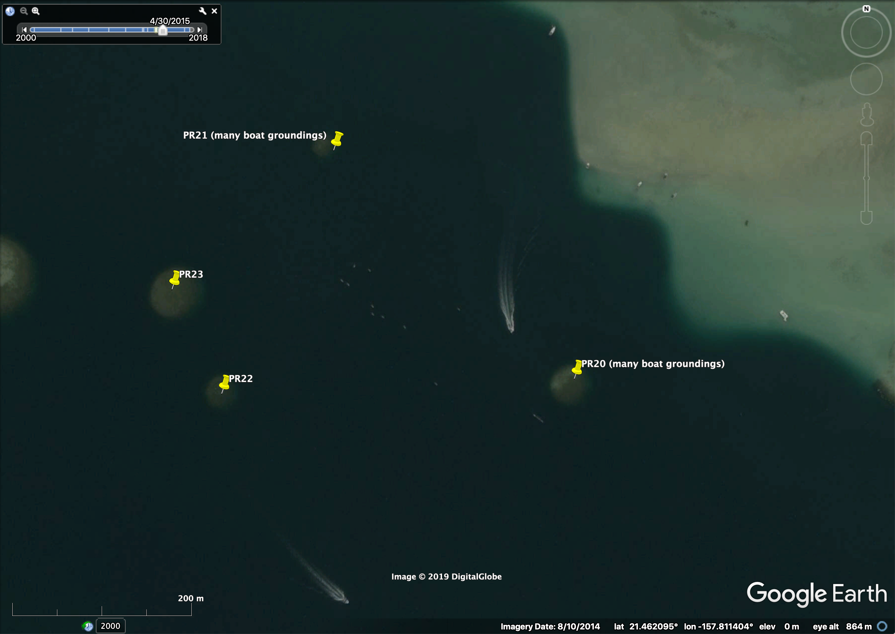

## Summary 

Tutorial on key features of Google Earth Engine and Planet Explorer. 

## Goals

* Gain familiarity with measurement and other features of:
    + Google Earth
    + Planet Explorer
* Start exploring feasibility of each of your three potential project topics.

## Components

#### Google Earth

* Labels
    + place names
    + grid
* Navigation 
    + by lat/long
        - -21.808627°, 35.431507° (Bazaruto Island, Mozamique)
        - 30.230207°, -88.930336° (Ship Island, Mississippi, USA)
    + by place name (choose own)
* Controls (upper right)
    + N (direction): change map orientation 
    + eye (look): change perspective
    + hand (move): pan around imagery
    + street view: try; see if relevant to your area
    + zoom: zoom in and out
        - two-finger zoom: put cursor in area to center on, then zoom
* Layers
    + 3D Buildings:
        - turn layer on; navigate (by name) to "Sydney Opera House"
        - work with controls to positions yourself as a drone hovering at lowest roo fpeak height
        - use N (direction) control to spin Opera House around
    + Terrain:
        - go to 36.232957°, -111.965179° (Grand Canyon, USA)
        - zoom to be in the canyon, then use controls to look up and around at the cliffs
* Screenshots
    + use your computer's screenshot command to capture this view, then save as .jpg (non-georectified)
* Placemarks
    + turn off tilt feature (GE -> Preferences -> Navigation -> "Do not automatically tilt while zooming")
    + navigate to another place (of choice)
    + create placemark (yellow pin)
    + choose new pin icon
    + extract coordinates and send to Slack rotation group 
    + name/save placemark
    + save "My Places" (File -> Save -> Save My Places)
* Measuring
    + lines
    + paths
    + polygons
    + save last polygon 
    + create "Measurements" folder in My Places and drag saved measurement in
* GPS coordinates
    + Tools -> GPS -> (can import coordinates this way, but we won't)
* Time Slider
    + turn on
    + check historical imagery availability
    + check image dates for different points on slider (bottom right) 
    + look at different dates & see how spatial resolution changes over time
* Resolution
    + there is no tool that will tell you the resolution of Google Earth's imagery in any specific location...but, you can: 
        - look at pixelation
        - check copyright
        - check nearby cars (see details below)
* Another fun feature: 
    + Flight Simulator (Tools -> Enter Flight Simulator)

#### Planet Explorer

* Labels
    + place names
* Coverage
    + cover
* Upload shapefiles 
* Draw AOI
* Measurements: 
    + distance/perimeter
    + area
* Timeframe
    + 3- or 1-month mosaic
    + daily
* Finding imagery (be sure to be set to Daily Imagery)
    + find one of your field sites (or somewhere else you like)
    + find the best and worst imagery for the past ~week
    + check the availale resolutions
    + change filters: 
        - cloud cover
        - area coverage
        - source
        - all filters - have a look
* 2-date comparisons
* Time lapse story

## Useful reference information

#### Summary of providers, satellites & resolutions in Google Earth 

These are at least the main types found in Google Earth, though this list is not necessarily exhaustive:

        Provider          | Instrument      | Spatial resolution (m) | Operational   
        ----------------- | --------------- | ---------------------- | ------------  
        US Geolog. Survey | Landsat         | 30 (15 pan-sharpened)  | LS1 from 1972; LS8 from Feb 2013 
        SpotImage         | SPOT 1-7        | 10 - 2.5               | Mar 1998 – Present 
        Digital Globe     | EarlyBird-1     | 3                      | Dec 1997 (3 days only)
        Digital Globe     | Ikonos          | ~1                     | Sep 1999 - Mar 2015   
        Digital Globe     | WorldView-1     | ~0.5                   | Sep 2007 - Present       
        Digital Globe     | WorldView-2     | ~0.5                   | Oct 2009 - Present       
        Digital Globe     | GeoEye-1        | ~0.5                   | Sep 2008 - Present  
        Digital Globe     | Quickbird       | ~0.5                   | Oct 2001 - Jan 2015   
        Airbus            | Pleiades        | ~0.5                   | Dec 2011 - Present  
        Digital Globe     | WorldView-3     | ~0.3                   | Aug 2014 - Present       
        Various           | Aerial systems  | ~0.15                  | Varies  
        Various           | Cameras on kites| A few cm               | Varies 

#### Summary of providers, satellites & resolutions in Planet Explorer 

These are the only types currently found in Planet Explorer:

        Provider          | Instrument      | Spatial resolution (m) | Operational   
        ----------------- | --------------- | ---------------------- | ------------  
        US Geolog. Survey | Landsat-8       | 30 (15 pan-sharpened)  | Feb 2013-present
        ESA (Eur Space Agency)| Sentinel-2A | 10                     | Jun 2015 - Present
        ESA (Eur Space Agency)| Sentinel-2B | 10                     | Mar 2017 - Present 
        Planet            | RapidEye        | 5                      | Aug 2008 - Present 
        Planet            | PlanetScope     | ~3                     | Jun 2016 - Present 
        Planet            | SkySat          | 0.72                   | Nov 2013 - Present        

#### Rules of thumb for determining spatial resolution of satellite imagery

from GIS Stack Exchange, answered by Christiaan Adams of Google Earth Outreach;
https://gis.stackexchange.com/questions/11395/spatial-resolution-of-google-earth-imagery/256850)

The resolution of imagery in Google Earth varies depending on the source of the data. When you zoom out, you will see the nice, pretty global coverage produced from a mosaic of many Landsat scenes, which have a native resolution of ~30m (~15m pan-sharpened).

Zooming in, you'll start to get high-resolution in most places. There are many rural areas, especially in Africa, where broad coverage is provided by the SPOT satellites, which produce anywhere from 10m to 1.5m resolution. Next you can still find some Ikonos data in a few places, at about 1m resolution. Then you get down to the really high-resolution satellites, including Digital Globe's WorldView-1/2/3 series, GeoEye-1, and Airbus' Pleiades, all of which provide data at around 0.5m resolution. That's about the limit for satellite data, though a few places are staring to get data from newer satellites (including WorldView-3) at around 0.3m.

In much of North America, Europe, Japan and some other places, you'll find even higher resolution images which generally come from aerial systems (cameras on airplanes), and a lot of that data in Google Earth is at about 0.15m resolution. Finally, there are just a few tiny spots around the world where Google Earth shows data collected by citizen scientists (through the Public Lab), using cameras on kites and balloons, which can get down into the few centimeters per pixel range.

There is no tool that will tell you the resolution of Google Earth's imagery in any specific location. 

Here are some fun rules of thumb I use to quickly estimate the resolution of what I'm looking at, by zooming in on cars. If roads and house roofs look like they are 2-5 pixels wide, then you are probably seeing SPOT's 5m or 2.5m products. If you can clearly make out the shapes of cars, but their windshields are poorly defined, then it might be 1m from Ikonos. If the windshield is pretty clear, but you can only barely (or not quite) make out the frame pillars along the sides of the windshield, then you're probably looking at 0.5m satellite imagery. If you can clearly make out the pillars, and start to see the side-view mirrors on the car, then you're most likely looking at aerial data in the 0.15m range. More generally, find an object that you know the approximate size of, and see about how many pixels it's covered by, and do the math.

There is a good suggestion in previous answers, that you zoom way in and look at the copyright strings, as that will often tell you at least what company the data came from (as well as the acquisition date listed in the status bar)... though for the aerial data that may not help as a copyright is often not listed. If it's from DigitalGlobe, then it's most often 0.5m. If you really want to dig in, you can go to the company's online imagery catalog, look in your desired location, search for images around the date provided, and try to find an image that looks the same (similar colors, cloud patterns, etc.). If you can find the corresponding image in the catalog, then you can see all the metadata, including which satellite and what resolution.

#### Problems I've encountered in Google Earth

* Date mismatches between TimeSlider and "Imagery date" (info at bottom right of image): e.g., 12/30/2008 on time slider says 12/31/2007 on bottom

* Same images given for multiple dates (e.g., 7/30/2006 on time slider is same image as 12/30/2008 on time slider) - this one also has mismatched "Imagery date"

* Different dates coming up on Time Slider for same image during different Google Earth sessions (i.e., image of PR 21 and area has come up on Time Slider for both 8/10/2014 and 4/30/2015, yet neither date appears as an option on Time Slider when the other date is given for the image) – see screenshots below. Note that both images have date 8/10/2014 in “Imagery Date” field at bottom of image. Note (tiny) Time Slider dates at top left of each image:

  
  
{ width=90%}
{ width=90%}  
  

 