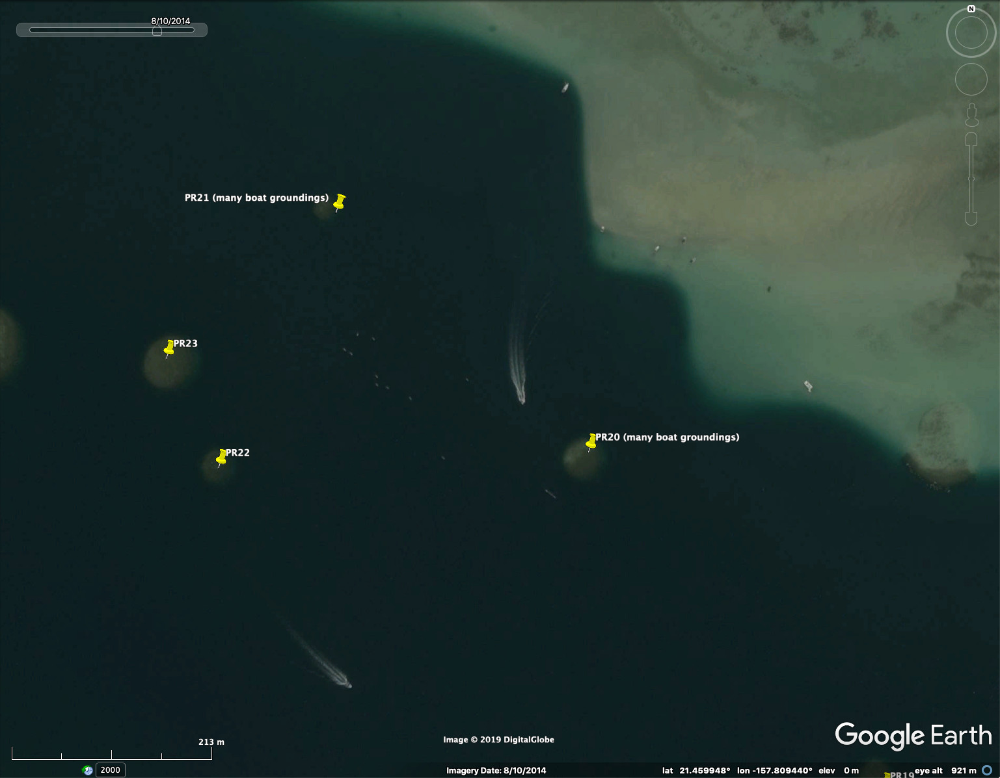

## Summary 

Tutorial on key features of Google Earth Engine and Planet Explorer. 

## Goals

* Gain familiarity with measurement and other features of:
    + Google Earth
    + Planet Explorer
* Exploring feasibility of if / how these platforms can be used in your own research

## Components

#### Google Earth

* Settings
    + turn off tilt feature (GE -> Preferences -> Navigation -> "Do not automatically tilt while zooming")
* Labels
    + place names
    + grid
* Navigation 
    + by lat/long (-21.808627°, 35.431507°: Bazaruto Island, Mozamique)
    + by place name (Hawaii Institute of Marine Biology)
* Controls (upper right)
    + N (direction): change map orientation 
    + eye (look): change perspective
    + zoom: zoom in and out
        - two-finger zoom: put cursor in area to center on, then zoom
    + with trackpad, cursor hover zooms into that location
* Layers
    + 3D Buildings:
        - turn layer on; navigate (by name) to "Sydney Opera House"
        - work with controls to position yourself as a drone hovering at lowest roof peak height
        - use N (direction) control to spin Opera House around
    + Terrain:
        - go to 36.232957°, -111.965179° (Grand Canyon, USA)
        - zoom to be in the canyon, then use controls to look up and around at the cliffs
* Screenshots
    + use your computer's screenshot command to capture this view, then save as .jpg (non-georectified)
* Placemarks
    + navigate to another place (of choice)
    + create placemark (yellow pin)
    + choose new pin icon
    + extract coordinates and send to all Slack remote sensing channel 
    + name/save placemark
    + drag place from Temporary Places to My Places (if not already there)
    + save "My Places" (File -> Save -> Save My Places)
* Measuring
    + lines
    + paths
    + polygons
    + save last polygon 
    + create "Measurements" folder in My Places and drag saved measurement in
* GPS coordinates
    + download the [GPS track for KBay sandbar](https://www.dropbox.com/s/ccjoiod4bsft46j/GPSTrack_KBaySandbar_FieldSiteExploration_2021_05.gpx?dl=0) (Annie's field site exploration!)
    + Tools -> GPS -> import from file -> import this track
* Time Slider
    + Navigate to "Subi Reef" (in the South China Sea)
        - turn off 3d Buildings and Terrain layers
        - turn on Time Slider
        - check historical imagery availability
        - use Time Slider to go back to April 2005
        - click forward, image by image, to see how it's changed since then
        - check image dates for different points on slider (bottom right)
        - how has the former reef changed over time?
    + Navigate to "The Presidio San Francisco"
        - click to the earliest imagery date, then check the copyright details (bottom centre of image); what kind of sensor do you think gathered this image?
        - click through a few dates to present
        - how does imagery type and spatial resolution change over time?
* Timelapse (for visualization of change)
    + Open [Google Earth web's Timelapse feature](https://earth.google.com/web/@44.69848065,58.8251508,132a,821204d,35y,-1h,54t,0r/data=CjISMBIgNTQ0MGExNzMxYzI1MTFlYTk0NDM4YmI2ODk0NDUyOTciDG1haW5Ob1JhbmRvbQ)
        - note: this feature is only currently available in the web-, iPhone-, or Android-based Google Earth platforms (not desktop app)
        - you may need to log out of your Google account to view it
    + In the bottom right, click the circle with "3D" (if you only see in that says "2D", you're already in 3D)
    + In the search bar, type "Palm Jumeirah" and watch the coastline
    + Naviagte to a [timelapse story](https://earth.app.goo.gl/SRcAV4) about soybean farming in Bolivia
    + on your own time, explore some of the cool pre-made timelapse stories
* Resolution
    + there is no tool that will tell you the resolution of Google Earth's imagery in any specific location...but, you can: 
        - look at pixelation
        - check copyright
        - check nearby cars (see details below)
* Another fun feature: Flight Simulator 
    + go to Tools -> Enter Flight Simulator
    + press Page Up key to increase thrust and taxi the plane down the runway
    + once the plane is moving, move the mouse slightly down. When you’re going fast enough, your plane will take off
    + when your plane reaches flight altitude and the wings have leveled off, center the mouse on your screen
    + to change directions, make course corrections, or bank right or left, use the arrow keys (small corrections work best)
    + to look around, press the arrow keys + Alt to turn slowly or + Ctrl to turn quickly
    + try not to crash!

#### Planet Explorer

* Log into [Planet Explorer](https://www.planet.com/explorer/#/zoom/2.36)
* Labels
    + place names
* Coverage
    + cover
* Upload shapefiles
* Draw AOI
* Measurements: 
    + distance/perimeter
    + area
* Timeframe
    + 3- or 1-month mosaic
    + daily
* Finding imagery (be sure to be set to Daily Imagery)
    + find one of your field sites (or somewhere else you like)
    + find the best and worst imagery for the past ~week
    + check the available resolutions
    + change filters: 
        - cloud cover
        - area coverage
        - source
        - all filters - have a look
* 2-date comparisons
* Time lapse story

## Useful reference information

#### Summary of providers, satellites & resolutions in Google Earth 

These are at least the main types found in Google Earth, though this list is not necessarily exhaustive:

        Provider          | Instrument      | Spatial resolution (m) | Operational   
        ----------------- | --------------- | ---------------------- | ------------  
        US Geolog. Survey | Landsat         | 30 (15 pan-sharpened)  | LS1 from 1972; LS8 from Feb 2013 
        SpotImage         | SPOT 1-7        | 10 - 2.5               | Mar 1998 – Present 
        Maxar (former DG) | EarlyBird-1     | 3                      | Dec 1997 (3 days only)
        Maxar (former DG) | Ikonos          | ~1                     | Sep 1999 - Mar 2015   
        Maxar (former DG) | WorldView-1     | ~0.5                   | Sep 2007 - Present       
        Maxar (former DG) | WorldView-2     | ~0.5                   | Oct 2009 - Present       
        Maxar (former DG) | GeoEye-1        | ~0.5                   | Sep 2008 - Present  
        Maxar (former DG) | Quickbird       | ~0.5                   | Oct 2001 - Jan 2015   
        Airbus            | Pleiades        | ~0.5                   | Dec 2011 - Present  
        Maxar (former DG) | WorldView-3     | ~0.3                   | Aug 2014 - Present       
        Various           | Aerial systems  | ~0.15                  | Varies  
        Various           | Cameras on kites| A few cm               | Varies 

#### Summary of providers, satellites & resolutions in Planet Explorer 

These are the only types currently found in Planet Explorer:

        Provider          | Instrument      | Spatial resolution (m) | Operational   
        ----------------- | --------------- | ---------------------- | ------------  
        US Geolog. Survey | Landsat-8       | 30 (15 pan-sharpened)  | Feb 2013-present
        ESA (Eur Space Agency)| Sentinel-2A | 10                     | Jun 2015 - Present
        ESA (Eur Space Agency)| Sentinel-2B | 10                     | Mar 2017 - Present 
        Planet            | RapidEye        | 5                      | Aug 2008 - April 2020 
        Planet            | PlanetScope     | ~3                     | Jun 2016 - Present 
        Planet            | SkySat          | 0.72                   | Nov 2013 - July 2021        
        Planet            | SkySat          | 0.5                    | July 2021 - Present        

#### Cost of imagery acquisition

The tools we'll be using are freely available (at least once access has been granted, in the case of Planet data), but in some cases in your work you may need more imagery than what's available within these platforms. Some satellite providers will consider requests for imagery 'grants' (e.g., Maxar - fomerly DigitalGlobe), but you can also buy imagery. Here's a [list](<https://b7q2j5q8.rocketcdn.me/wp-content/uploads/2018/04/landinfo.com-LAND_INFO_Satellite_Imagery_Pricing.pdf>) that gives an idea of the cost (by satellite, in $ USD, per km2) of acquiring imagery. Note that most providers offer an academic discount of between 20-50%.

#### Rules of thumb for determining spatial resolution of satellite imagery

The resolution of imagery in Google Earth varies depending on the source of the data. When you zoom out, you will see the nice, pretty global coverage produced from a mosaic of many Landsat scenes, which have a native resolution of ~30m (~15m pan-sharpened).

Zooming in, you'll start to get high-resolution in most places. There are many rural areas, especially in Africa, where broad coverage is provided by the SPOT satellites, which produce anywhere from 10m to 1.5m resolution. Next you can still find some Ikonos data in a few places, at about 1m resolution. Then you get down to the really high-resolution satellites, including Maxar's WorldView-1/2/3 series, GeoEye-1, and Airbus' Pleiades, all of which provide data at around 0.5m resolution. That's about the limit for satellite data, though a few places are staring to get data from newer satellites (including WorldView-3) at around 0.3m.

In much of North America, Europe, Japan and some other places, you'll find even higher resolution images which generally come from aerial systems (cameras on airplanes), and a lot of that data in Google Earth is at about 0.15m resolution. Finally, there are just a few tiny spots around the world where Google Earth shows data collected by citizen scientists (through the Public Lab), using drones or cameras on kites / balloons, which can get down into the few centimeters per pixel range.

There is no tool that will tell you the resolution of Google Earth's imagery in any specific location. 

Here are some intuitive rules of thumb that I use to quickly estimate the resolution of what I'm looking at, by zooming in on cars (adapted from [the helpful answer](https://gis.stackexchange.com/questions/11395/spatial-resolution-of-google-earth-imagery/256850) provided by Christiaan Adams of Google Earth Outreach on GIS Stack Exchange). If roads and house roofs look like they are 2-5 pixels wide, then you are probably seeing SPOT's 5m or 2.5m products. If you can clearly make out the shapes of cars, but their windshields are poorly defined, then it might be 1m from Ikonos. If the windshield is pretty clear, but you can only barely (or not quite) make out the frame pillars along the sides of the windshield, then you're probably looking at 0.5m satellite imagery. If you can clearly make out the pillars, and start to see the side-view mirrors on the car, then you're most likely looking at aerial data in the 0.15m range. More generally, find an object that you know the approximate size of, and see about how many pixels it's covered by, and do the math.

There is a good suggestion in previous answers, that you zoom way in and look at the copyright strings, as that will often tell you at least what company the data came from (as well as the acquisition date listed in the status bar)... though for the aerial data that may not help as a copyright is often not listed. If it's from Maxar, then it's most often 0.5m. If you really want to dig in, you can go to the company's online imagery catalog, look in your desired location, search for images around the date provided, and try to find an image that looks the same (similar colors, cloud patterns, etc.). If you can find the corresponding image in the catalog, then you can see all the metadata, including which satellite and what resolution.

#### Problems I've encountered in Google Earth

* Date mismatches between TimeSlider and "Imagery date" (info at bottom right of image): e.g., 12/30/2008 on time slider says 12/31/2007 on bottom

* Same images given for multiple dates (e.g., 7/30/2006 on time slider is same image as 12/30/2008 on time slider) - this one also has mismatched "Imagery date"

* Different dates coming up on Time Slider for same image during different Google Earth sessions (i.e., image of PR 21 and area has come up on Time Slider for both 8/10/2014 and 4/30/2015, yet neither date appears as an option on Time Slider when the other date is given for the image) – see screenshots below. Note that both images have date 8/10/2014 in “Imagery Date” field at bottom of image. Note (tiny) Time Slider dates at top left of each image:

  
  
{ width=90%}
{ width=90%}  
  

 